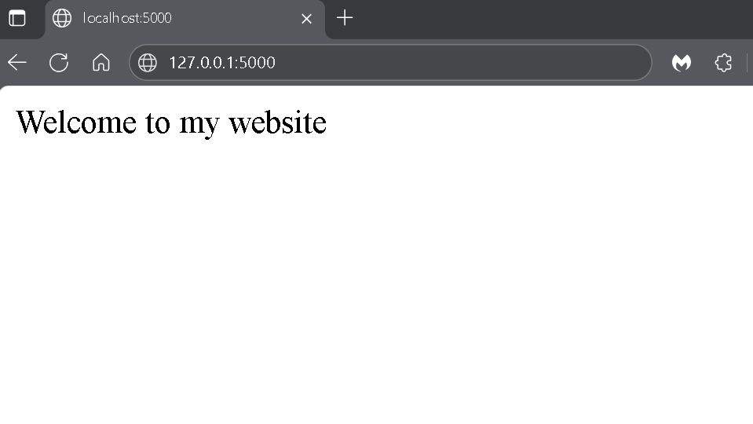

# Flask + Redis App (Dockerised) 🐳

[](https://www.docker.com/)
[](https://flask.palletsprojects.com/)
[](https://redis.io/)

## Demo GIF:


A containerised web app built with Flask and Redis using Docker Compose. The Flask service connects to a Redis database to count and store page visits.

---

## Features
- Flask web app container running locally on port 5000  
- Redis container for view count storage  
- Docker Compose for orchestration and network configuration  
- Lightweight and easily extendable setup

---

## How It Works
- The Flask app handles HTTP requests and displays the current view count.  
- Redis stores and increments the counter each time the page is accessed.  
- Both containers communicate through Docker’s internal network using the service name `redis` as the hostname.

---

## Setup
### 1. Clone the repository
```bash
git clone git@github.com:yourusername/flask-redis-app.git
cd flask-redis-app
```

### 2. Build and run the containers
```bash
docker-compose up --build
```

### 3. Open the app  
- Visit `http://localhost:5000` in your browser to view the welcome page.
- Visit `http://localhost:5000/count` in your browser to view the welcome page.

Each page refresh increments the counter stored in Redis.

---

## Environment Variables
Defined in `docker-compose.yml`:  
```yaml
REDIS_HOST=redis
```

This variable tells Flask the hostname of the Redis service within the Docker network.

---

## Stack
- **Python (Flask)** – web framework  
- **Redis** – in-memory data store  
- **Docker / Docker Compose** – containerisation and orchestration

---

## Future Enhancements/Considerations
- Add a persistent Redis volume to retain data after restarts  
- Include a basic HTML template for better presentation  
- Deploy to a cloud service such as AWS ECS or Azure Container Apps

---

## Project Structure

```
flask-redis-app/  
│  
├── app.py – Flask application  
├── Dockerfile – Build instructions for Flask container  
├── docker-compose.yml – Multi-container setup  
├── requirements.txt – Python dependencies  
└── README.md  
```
